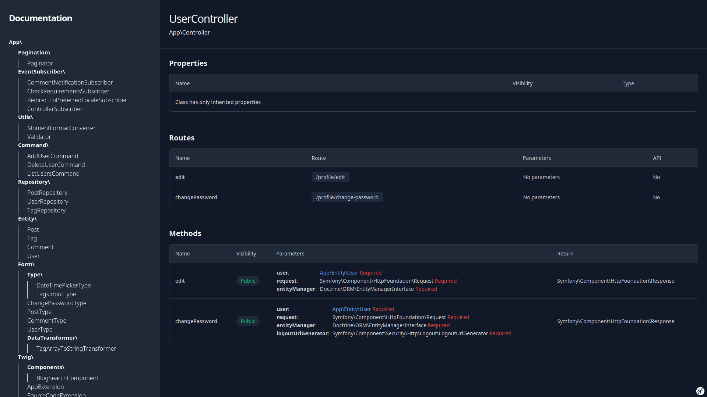
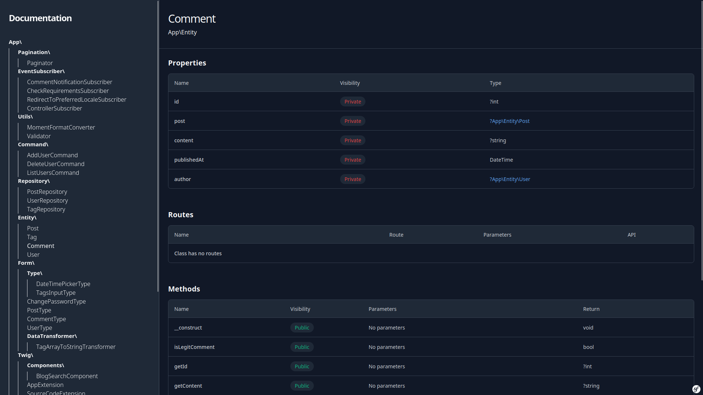

NvdocBundle
==========

NvdocBundle provides automatic documentation generation for Symfony project.




Installation
---------

NvdocBundle requires PHP 8.1 or higher and Symfony 5.0 or higher.
Run the following command to install it in your application:

`$ composer require nvkode/nvdoc-bundle`

Install assets

`$ symfony console assets:install`

After add routes in config/routes.yaml

**Symfony 5:**

```
controllers:
  resource: ../src/Controller/
  type: annotation

nvdoc:
  resource: '@NvdocBundle/Controller/'
  prefix: /
```

**Symfony 6:**

```
nvdoc:
    resource: '@NvdocBundle/Controller'
    type: attribute
```

Now you can access docs

`https://yourdomain/docs`

Annotations
---------

**NVParam**

For displaying method in Routes table you should use #[Route] attribute.
NVParam is optional annotation which will be parsed in parameters column.

Example:

```php

/**
 * @NVParam('name', 'type', 'required')
 * @NVParam('name', 'type')
 * @NVParam('name')
 */
#[Route(
    path: '/'
)]
public function index(): Response
{
    return $this->render('index.html.twig');
}
```

Output:

| Name  | Route | Parameters                                                                        | API |
|-------|-------|-----------------------------------------------------------------------------------|-----|
| index | /     | name string    REQUIRED<br/>name type      undefined<br/>name undefined undefined | No  |

**NVAPI**

Set up route as API route.

Example:

```php

/**
 * @NVParam('name', 'type', 'required')
 * @NVAPI
 */
#[Route(
    path: '/'
)]
public function index(): Response
{
    return $this->render('index.html.twig');
}
```

Output:

| Name  | Route | Parameters           | API |
|-------|-------|----------------------|-----|
| index | /     | name string REQUIRED | Yes |

Dependencies
---------

* [nvkode/nvdoc](https://github.com/nvkode/nvdoc)

Resources
---------

* [Report issues](https://github.com/nvkode/nvdoc-bundle/issues) and
  [send Pull Requests](https://github.com/nvkode/nvdoc-bundle/pulls)
